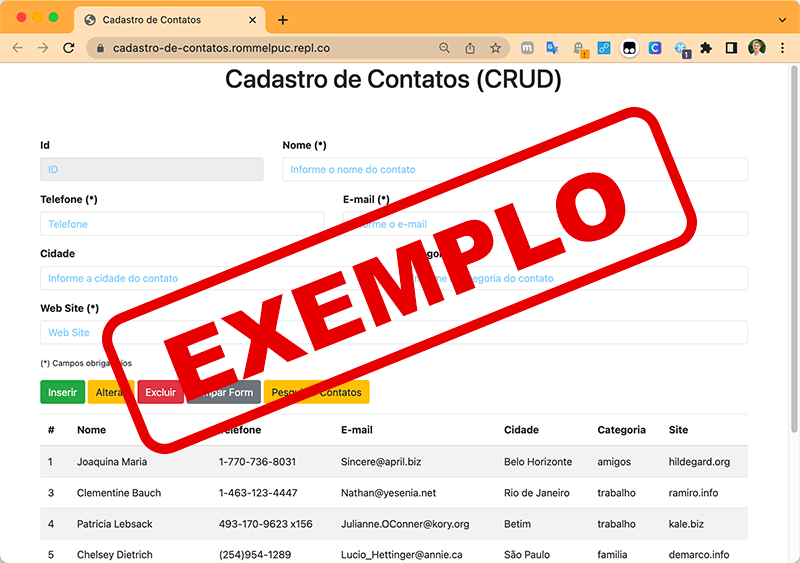

# Arquitetura da solução

<span style="color:red">Pré-requisitos: <a href="05-Projeto-interface.md"> Projeto de interface</a></span>

Definição de como o software é estruturado em termos dos componentes que fazem parte da solução e do ambiente de hospedagem da aplicação.


## Funcionalidades

Esta seção apresenta as funcionalidades da solução.

##### Funcionalidade 1 - Cadastro de contatos ⚠️ EXEMPLO ⚠️

Permite a inclusão, leitura, alteração e exclusão de contatos para o sistema

* **Estrutura de dados:** [Contatos](#estrutura-de-dados---contatos)
* **Instruções de acesso:**
  * Abra o site e efetue o login;
  * Acesse o menu principal e escolha a opção "Cadastros";
  * Em seguida, escolha a opção "Contatos".
* **Tela da funcionalidade**:



> ⚠️ **APAGUE ESTA PARTE ANTES DE ENTREGAR SEU TRABALHO**
>
> Apresente cada uma das funcionalidades que a aplicação fornece tanto para os usuários, quanto aos administradores da solução.
>
> Inclua, para cada funcionalidade, itens como: (1) títulos e descrição da funcionalidade; (2) estrutura de dados associada; (3) o detalhe sobre as instruções de acesso e uso.

### Estruturas de dados

Descrição das estruturas de dados utilizadas na solução com exemplos no formato JSON.Info.

##### Estrutura de dados - Contatos

Contatos da aplicação

```json
  {
    "id": 1,
    "nome": "Leanne Graham",
    "cidade": "Belo Horizonte",
    "categoria": "amigos",
    "email": "Sincere@april.biz",
    "telefone": "1-770-736-8031",
    "website": "hildegard.org"
  }
  
```

##### Estrutura de dados - Usuários  ⚠️ EXEMPLO ⚠️

Registro dos usuários do sistema utilizados para login e para o perfil do sistema.

```json
  {
    id: "eed55b91-45be-4f2c-81bc-7686135503f9",
    email: "admin@abc.com",
    id: "eed55b91-45be-4f2c-81bc-7686135503f9",
    login: "admin",
    nome: "Administrador do Sistema",
    senha: "123"
  }
```
##### Funcionalidade 1 - Cadastro de Notícias 

Permite a inclusão, leitura, alteração e exclusão de notícias para o sistema

* **Estrutura de dados:** [Notícias](#estrutura-de-dados---Notícias)
* **Instruções de acesso:**
  * Abra o site e efetue o login;
  * Acesse o menu principal e escolha a opção "Notícias";
  * Em seguida, preencha o formulário e cadastre uma nova notícia.
* **Tela da funcionalidade**:


### Estruturas de dados

A aplicação utiliza uma estrutura baseada em objetos JSON para representar e armazenar as notícias cadastradas. Cada notícia é representada como um objeto com as seguintes propriedades:

##### Estrutura de dados - Notícias

Notícias cadastradas na aplicação:

```json
  {
    "id": "13",
      "titulo": "Linha direta entre bairros é criada para facilitar deslocamentos",
      "autor": "Lucas Gabriel",
      "conteudo": "Novo itinerário ligando os bairros Santa Rita e Palmeiras entra em operação hoje. Ônibus circulam de 15 em 15 minutos.",
      "data": "07/06/2025"
  }
  
```
##### Funcionalidade 2 - Pesquisas por Rotas Rodoviárias 

Permite a pesquisa de rotas rodoviárias cadastradas no sistema.

* **Estrutura de dados:** [Rotas](#estrutura-de-dados---rotas)
* **Instruções de acesso:**
  * Abra o site e efetue o login;
  * Acesse o menu principal e escolha a opção "rotas";
  * Em seguida, preencha o campo de busca com a rota desejada.
* **Tela da funcionalidade**:


### Estruturas de dados

A aplicação utiliza objetos JSON para armazenar informações sobre rotas de ônibus. Cada rota é representada por um objeto contendo os seguintes campos:

##### Estrutura de dados - Notícias

Rotas cadastradas na aplicação:

```json
  {
    "id": "9",
      "numero_rota": "910",
      "sentido": "Norte",
      "trajeto": "Venda Nova - Terminal Vilarinho",
      "preco": "5.90"
  }
  
```


### Módulos e APIs

Esta seção apresenta os módulos e APIs utilizados na solução.

**Images**:

* Unsplash - [https://unsplash.com/](https://unsplash.com/) ⚠️ EXEMPLO ⚠️

**Fonts:**

* Icons Font Face - [https://fontawesome.com/](https://fontawesome.com/) ⚠️ EXEMPLO ⚠️

**Scripts:**

* jQuery - [http://www.jquery.com/](http://www.jquery.com/) ⚠️ EXEMPLO ⚠️
* Bootstrap 4 - [http://getbootstrap.com/](http://getbootstrap.com/) ⚠️ EXEMPLO ⚠️

> ⚠️ **APAGUE ESTA PARTE ANTES DE ENTREGAR SEU TRABALHO**
>
> Apresente os módulos e APIs utilizados no desenvolvimento da solução. Inclua itens como: (1) frameworks, bibliotecas, módulos, etc. utilizados no desenvolvimento da solução; (2) APIs utilizadas para acesso a dados, serviços, etc.


## Hospedagem

Explique como a hospedagem e o lançamento da plataforma foram realizados.

> **Links úteis**:
> - [Website com GitHub Pages](https://pages.github.com/)
> - [Programação colaborativa com Repl.it](https://repl.it/)
> - [Getting started with Heroku](https://devcenter.heroku.com/start)
> - [Publicando seu site no Heroku](http://pythonclub.com.br/publicando-seu-hello-world-no-heroku.html)
